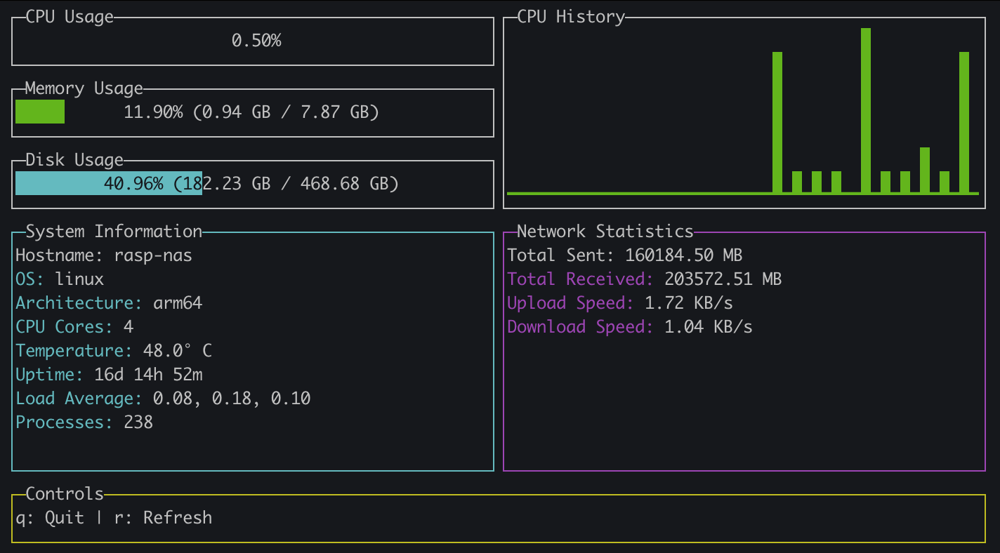

# Go Raspberry Pi Monitor

라즈베리파이를 위한 실시간 시스템 모니터링 도구입니다. 터미널 기반의 직관적인 UI로 CPU, 메모리, 디스크 사용량과 네트워크 통계를 실시간으로 모니터링할 수 있습니다.

## 📸 스크린샷



## 🚀 주요 기능

- **실시간 시스템 모니터링**: CPU, 메모리, 디스크 사용량을 실시간으로 표시
- **CPU 히스토리 차트**: CPU 사용량의 시간별 변화를 시각화
- **라즈베리파이 온도 모니터링**: CPU 온도 실시간 측정
- **네트워크 통계**: 업로드/다운로드 속도 및 총 데이터 전송량 표시
- **시스템 정보**: 호스트명, OS, 아키텍처, 업타임, 로드 평균 등
- **반응형 UI**: 터미널 크기에 따라 자동으로 레이아웃 조정
- **색상 코딩**: 사용량에 따른 색상 변화 (녹색 → 노란색 → 빨간색)

## 📋 시스템 요구사항

- Go 1.25.1 이상
- Linux (라즈베리파이 OS 권장)
- 터미널 환경

## 🛠️ 설치 및 실행

### 1. 저장소 클론
```bash
git clone https://github.com/yourusername/go_rasp_monitor.git
cd go_rasp_monitor
```

### 2. 의존성 설치
```bash
go mod tidy
```

### 3. 프로그램 실행
```bash
go run main.go
```

### 4. 바이너리 빌드 (선택사항)
```bash
go build -o rasp-monitor main.go
./rasp-monitor
```

## 🎮 사용법

### 키보드 단축키
- `q` 또는 `Ctrl+C`: 프로그램 종료
- `r`: 수동 새로고침
- 터미널 크기 조정 시 자동으로 레이아웃 재배치

### 화면 구성
- **왼쪽 상단**: CPU, 메모리, 디스크 사용량 게이지
- **오른쪽 상단**: CPU 사용량 히스토리 차트
- **왼쪽 하단**: 시스템 정보 (호스트명, OS, 온도, 업타임 등)
- **오른쪽 하단**: 네트워크 통계 (전송량, 속도)
- **하단**: 컨트롤 가이드

## 🔧 기술 스택

- **언어**: Go 1.25.1
- **UI 라이브러리**: [termui/v3](https://github.com/gizak/termui)
- **시스템 모니터링**: [gopsutil/v3](https://github.com/shirou/gopsutil)
- **라이선스**: GNU GPL v3

## 📊 모니터링 정보

### CPU 모니터링
- 실시간 CPU 사용률 (%)
- CPU 코어별 사용률
- CPU 사용량 히스토리 차트

### 메모리 모니터링
- 메모리 사용률 (%)
- 사용 중인 메모리 (GB)
- 총 메모리 (GB)

### 디스크 모니터링
- 디스크 사용률 (%)
- 사용 중인 디스크 공간 (GB)
- 총 디스크 공간 (GB)

### 네트워크 모니터링
- 총 전송 데이터량 (MB)
- 총 수신 데이터량 (MB)
- 실시간 업로드 속도 (KB/s)
- 실시간 다운로드 속도 (KB/s)

### 시스템 정보
- 호스트명
- 운영체제
- 아키텍처
- CPU 코어 수
- CPU 온도 (라즈베리파이)
- 시스템 업타임
- 로드 평균
- 실행 중인 프로세스 수

## 🌡️ 라즈베리파이 특화 기능

이 도구는 라즈베리파이에 최적화되어 있으며, 다음 기능을 제공합니다:

- **CPU 온도 모니터링**: `/sys/class/thermal/thermal_zone0/temp`에서 온도 읽기
- **라즈베리파이 OS 호환성**: 라즈베리파이 OS에서 완벽하게 동작
- **저전력 최적화**: 리소스 사용량 최소화

## 🎨 UI 특징

- **색상 코딩**: 
  - 🟢 녹색: 정상 범위 (0-50%)
  - 🟡 노란색: 주의 범위 (50-80%)
  - 🔴 빨간색: 위험 범위 (80%+)
- **반응형 레이아웃**: 터미널 크기에 따른 자동 조정
- **실시간 업데이트**: 1초마다 자동 새로고침

## 🤝 기여하기

1. 이 저장소를 포크합니다
2. 새로운 기능 브랜치를 생성합니다 (`git checkout -b feature/amazing-feature`)
3. 변경사항을 커밋합니다 (`git commit -m 'Add some amazing feature'`)
4. 브랜치에 푸시합니다 (`git push origin feature/amazing-feature`)
5. Pull Request를 생성합니다

## 📝 라이선스

이 프로젝트는 GNU General Public License v3.0에 따라 라이선스가 부여됩니다. 자세한 내용은 [LICENSE](LICENSE) 파일을 참조하세요.

## 📞 지원

문제가 발생하거나 기능 요청이 있으시면 [Issues](https://github.com/yourusername/go_rasp_monitor/issues) 페이지에서 알려주세요.

⭐ 이 프로젝트가 도움이 되었다면 스타를 눌러주세요!