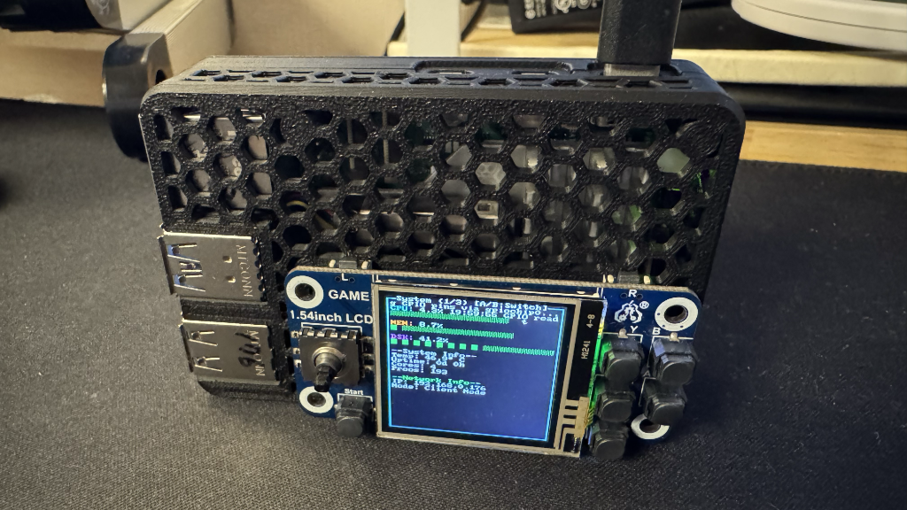

# Go Raspberry Pi Monitor

라즈베리파이를 위한 실시간 시스템 모니터링 도구입니다. 터미널 기반의 직관적인 UI로 CPU, 메모리, 디스크 사용량과 네트워크 통계를 실시간으로 모니터링할 수 있습니다. 물리적 버튼을 통한 제어와 3가지 뷰 모드를 지원합니다.

## 📸 스크린샷



## 🚀 주요 기능

- **3가지 뷰 모드**: System, Process, Network 뷰로 분리된 모니터링
- **실시간 시스템 모니터링**: CPU, 메모리, 디스크 사용량을 실시간으로 표시
- **프로세스 모니터링**: 실시간 프로세스 목록 및 CPU 사용률 순위 표시
- **네트워크 통계**: 업로드/다운로드 속도 및 총 데이터 전송량 표시
- **라즈베리파이 온도 모니터링**: CPU 온도 실시간 측정
- **AP 모드 감지**: WiFi AP 모드 상태 자동 감지
- **물리적 버튼 제어**: GPIO 버튼을 통한 직관적인 조작
- **시스템 정보**: IP 주소, 네트워크 모드, 업타임, 프로세스 수 등
- **반응형 UI**: 터미널 크기에 따라 자동으로 레이아웃 조정
- **색상 코딩**: 사용량에 따른 색상 변화 (녹색 → 노란색 → 빨간색)
- **로그 파일**: 디버깅을 위한 자동 로그 생성

## 📋 시스템 요구사항

- Go 1.19 이상
- Linux (라즈베리파이 OS 권장)
- 터미널 환경
- GPIO 버튼 사용 시: `gpiod` 패키지 설치 필요

## 🛠️ 설치 및 실행

### 1. 저장소 클론
```bash
git clone https://github.com/yourusername/go_rasp_monitor.git
cd go_rasp_monitor
```

### 2. GPIO 지원 설치 (선택사항)
```bash
sudo apt-get update
sudo apt-get install gpiod
```

### 3. 의존성 설치
```bash
go mod tidy
```

### 4. 프로그램 실행
```bash
go run main.go
```

### 5. 바이너리 빌드 (선택사항)
```bash
go build -o raspi-monitor main.go
./raspi-monitor
```

## 🎮 사용법

### 키보드 단축키
- `q` 또는 `Ctrl+C`: 프로그램 종료
- `Tab`: 뷰 모드 전환 (System → Process → Network)
- `↑/↓`: 프로세스 목록에서 위/아래 이동 (Process 뷰에서만)
- 터미널 크기 조정 시 자동으로 레이아웃 재배치

### GPIO 버튼 제어 (라즈베리파이)
- **A/B 버튼**: 뷰 모드 전환
- **↑/↓ 버튼**: 프로세스 목록에서 위/아래 이동
- **중앙 버튼**: 메뉴/선택
- **기타 버튼**: 향후 기능 확장 예정

### 뷰 모드 구성
- **System 뷰 (1/3)**: CPU, 메모리, 디스크 사용량 및 시스템 정보
- **Process 뷰 (2/3)**: 실시간 프로세스 목록 (CPU 사용률 순)
- **Network 뷰 (3/3)**: 네트워크 전송량 및 속도 통계

## 🔧 기술 스택

- **언어**: Go 1.19
- **UI 라이브러리**: [termui/v3](https://github.com/gizak/termui)
- **시스템 모니터링**: [gopsutil/v3](https://github.com/shirou/gopsutil)
- **GPIO 제어**: `gpioget` 명령어 (gpiod 패키지)
- **라이선스**: GNU GPL v3

## 📊 모니터링 정보

### System 뷰 모니터링
- **CPU**: 실시간 CPU 사용률 (%) 및 시각적 바
- **메모리**: 메모리 사용률 (%) 및 시각적 바
- **디스크**: 디스크 사용률 (%) 및 시각적 바
- **온도**: CPU 온도 (라즈베리파이)
- **업타임**: 시스템 가동 시간 (일/시간)
- **코어 수**: CPU 코어 수
- **프로세스 수**: 실행 중인 프로세스 수
- **IP 주소**: 현재 네트워크 IP 주소
- **네트워크 모드**: AP 모드 또는 클라이언트 모드

### Process 뷰 모니터링
- **프로세스 목록**: CPU 사용률 순으로 정렬된 프로세스 목록
- **프로세스 정보**: PID, 이름, CPU 사용률
- **실시간 업데이트**: 1초마다 자동 새로고침
- **스크롤 지원**: ↑/↓ 키 또는 버튼으로 탐색

### Network 뷰 모니터링
- **총 전송량**: 업로드/다운로드 총 데이터량 (MB)
- **실시간 속도**: 현재 업로드/다운로드 속도 (KB/s)
- **네트워크 상태**: 연결 상태 및 모드 정보

## 🌡️ 라즈베리파이 특화 기능

이 도구는 라즈베리파이에 최적화되어 있으며, 다음 기능을 제공합니다:

- **CPU 온도 모니터링**: `/sys/class/thermal/thermal_zone0/temp`에서 온도 읽기
- **GPIO 버튼 지원**: 물리적 버튼을 통한 직관적인 제어
- **AP 모드 감지**: WiFi AP 모드 상태 자동 감지
- **라즈베리파이 OS 호환성**: 라즈베리파이 OS에서 완벽하게 동작
- **저전력 최적화**: 리소스 사용량 최소화
- **로그 파일**: `raspi-monitor.log` 파일로 디버깅 정보 저장

## 🎨 UI 특징

- **3가지 뷰 모드**: System, Process, Network 뷰로 분리된 모니터링
- **색상 코딩**: 
  - 🟢 녹색: 정상 범위 (0-50%)
  - 🟡 노란색: 주의 범위 (50-80%)
  - 🔴 빨간색: 위험 범위 (80%+)
- **반응형 레이아웃**: 터미널 크기에 따른 자동 조정
- **실시간 업데이트**: 1초마다 자동 새로고침
- **프로세스 하이라이트**: 선택된 프로세스 시각적 강조
- **진행률 바**: CPU, 메모리, 디스크 사용량 시각화


## 📝 라이선스

이 프로젝트는 GNU General Public License v3.0에 따라 라이선스가 부여됩니다. 자세한 내용은 [LICENSE](LICENSE) 파일을 참조하세요.

## 📞 지원

문제가 발생하거나 기능 요청이 있으시면 [Issues](https://github.com/yourusername/go_rasp_monitor/issues) 페이지에서 알려주세요.

⭐ 이 프로젝트가 도움이 되었다면 스타를 눌러주세요!